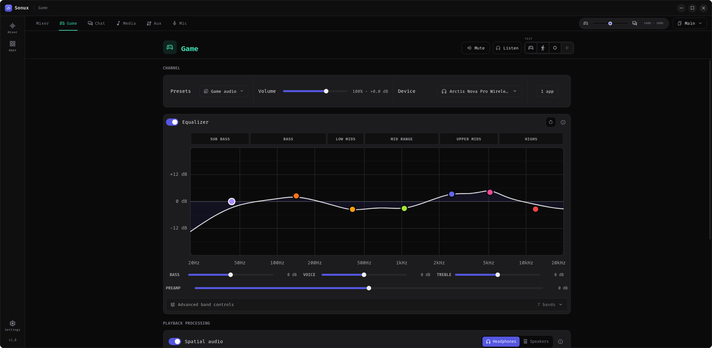
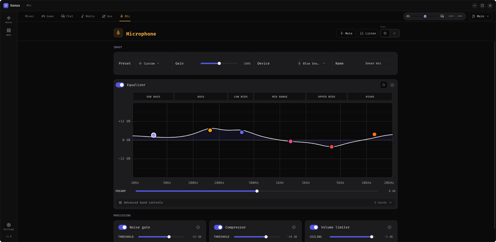

# Sonux

**Sonux — SteelSeries Sonar meets Linux.**

> [!IMPORTANT]
> **AI-assisted development disclosure:** I maintain Sonux and have used
> OpenAI Codex while developing it. Codex has helped me with code review and
> implementation, documentation, testing, release packaging, and reviewing
> redistribution and licensing requirements. I make the final project
> decisions and take responsibility for what I publish.

> [!CAUTION]
> **Security and third-party software:** I recommend reviewing Sonux itself,
> its install and build scripts, and every third-party package or library
> before installing or running them. Check the source and publisher, requested
> permissions, package signatures or checksums when available, and only use
> software you trust. This is good practice for all software, not something
> unique to Sonux.

Sonux is a Linux-native gaming audio router and mixer built on PipeWire.
It provides per-application channels, recordable mixes, microphone processing,
parametric EQ, and optional 7.1-to-binaural spatial audio.

Sonux is a modified version of [Sink](https://github.com/NC1107/sink). See
[ATTRIBUTION.md](ATTRIBUTION.md) and [THIRD_PARTY_NOTICES.md](THIRD_PARTY_NOTICES.md)
for upstream and bundled-asset notices.

Sonux is an independent project and is not affiliated with or endorsed by
SteelSeries.

## Project status and community

I originally built Sonux as a small personal learning project because I liked
how SteelSeries Sonar worked on Windows and wanted a similar experience on
Linux. Sink was the closest visually pleasing alternative I found, but it was
missing some of the settings I wanted. That encouraged me to learn from it and
expand it for my own setup.

Sonux would not exist without [Sink](https://github.com/NC1107/sink). Most of
the credit for the original application and its foundation belongs to Sink and
its creator, NC1107. My work has focused on expanding that foundation with the
controls and audio features I wanted from a Sonar-like Linux application.

Sonux is primarily a personal project without a fixed release schedule. I may
update it from time to time and intend to prioritize known security issues and
serious bugs, but users should not expect continuous feature development or
guaranteed support.

Forking is welcomed and encouraged. Feel free to adapt Sonux to your own audio
setup, experiment with its processing, or continue development in a direction
that suits you. Please retain the required GPL and third-party notices when
redistributing a fork.

## Distribution compatibility

Sonux is developed and tested on CachyOS. Other distributions listed below
have not yet been tested by me, so their presence in this table is not a
compatibility guarantee. They are included to show the intended Linux targets
and their likely installation route.

| Distribution | Test status | Intended installation route |
| --- | --- | --- |
| CachyOS | Tested — built and run on CachyOS | Build from source with `./install.sh` |
| Arch Linux, Manjaro, EndeavourOS | Not yet tested | Build from source; release package planned |
| Ubuntu, Debian, Linux Mint | Not yet tested | Build from source; `.deb` release planned |
| Fedora | Not yet tested | Build from source; `.rpm` release planned |
| openSUSE | Not yet tested | Build from source; `.rpm` release planned |
| Other PipeWire-based distributions | Not yet tested | Source build or AppImage, when available |

Regardless of distribution, Sonux requires PipeWire with PulseAudio
compatibility and WirePlumber 0.5 or newer. Reports and fixes from users of
other distributions are welcome.

## Features

- Route applications into Game, Chat, Media, Aux, or custom channels.
- Control channel volume, mute, output device, EQ, and playback processing.
- Create recordable mixes for OBS and other capture software.
- Process a microphone with gain, EQ, gate, compressor, and limiter.
- Save profiles and use optional global mute shortcuts.
- Render Game and Media 7.1 channels to binaural stereo for headphones.

## How Sonux works

Sonux builds its mixer on PipeWire. Applications using PulseAudio compatibility
or native PipeWire appear in the audio graph and can be assigned to Game,
Chat, Media, Aux, or user-created channels. WirePlumber rules keep those
virtual devices and application assignments available between sessions.

Each channel has independent volume, output routing, and parametric EQ. Sonux
also creates recordable mixes that applications such as OBS can select as
audio sources. The microphone path is processed separately with gain, EQ,
noise gate, compressor, and limiter stages.

Game and Media can expose stable eight-channel devices in the standard 7.1
order. With headphone spatial audio enabled, Sonux filters each virtual speaker
for the left and right ears and combines the eight channels into binaural
stereo. If spatial processing is disabled or its HRTF data cannot be loaded,
Sonux uses a conventional stereo downmix so channels are not silently lost.

## Screenshots

### Mixer


### Game equalizer and spatial audio



### Spatial audio controls


### Microphone processing



## Included audio data and supporting libraries

### Aalto University near-field HRTF

An HRTF, or head-related transfer function, describes how a sound arriving
from a particular direction is changed by the listener's head and ears before
it reaches each ear. Those small timing and frequency differences are what let
headphones create the impression that a sound is in front, beside, or behind
the listener instead of directly inside their head.

Sonux embeds the 48 kHz `NF_LIB_HRTF_LFE.sofa` dataset from the
[Aalto University near-field HRTF database](https://doi.org/10.5281/zenodo.7316545).
The dataset contains measurements for 196 source positions at four distances.
Sonux uses the 0.2-metre measurements for its 7.1 virtual speaker positions.
`libmysofa` loads and interpolates the SOFA measurement data, while FFTW
performs the real-time convolution that applies the resulting filters to the
audio. The dataset is licensed under CC BY 4.0; its creators and publication
are credited in
[AALTO_HRTF_ATTRIBUTION.md](third_party/spatial/licenses/AALTO_HRTF_ATTRIBUTION.md).
Technical details and the expected dataset checksum are documented in
[third_party/spatial/README.md](third_party/spatial/README.md).

### Audio test clips

The built-in Game, Chat, and Media test buttons use six short CC0 clips stored
as 48 kHz stereo PCM. They let users check routing and processing without
opening another application. Their sources and transformations are documented
in [the test-audio notice](src-tauri/assets/test-audio/LICENSES.md).

These clips are only general-purpose defaults. Users and fork maintainers are
encouraged to replace them with legally usable test material that better
matches the games, voices, music, or other audio they want to evaluate. To
replace a bundled file directly, keep its existing filename and provide
headerless 48 kHz stereo signed 16-bit little-endian PCM (`.s16le`). Published
forks should document the source and license of every replacement. No audio
from sample libraries that prohibit redistribution is included in Sonux.

### Interface resources

The interface bundles Fira Code under the SIL Open Font License and Material
Symbols under Apache-2.0. A complete overview of bundled material and its
licenses is available in [THIRD_PARTY_NOTICES.md](THIRD_PARTY_NOTICES.md).

## Install from a downloaded folder

Install the build dependencies listed below, open a terminal in the extracted
folder, and run:

```bash
./install.sh
```

This builds Sonux and installs it for the current user under `~/.local`. It
does not use `sudo` and does not install system packages.

## Planned GitHub release packages

> [!NOTE]
> Prebuilt packages are not published yet. For now, install Sonux from a
> downloaded source folder or clone the repository. When packages become
> available, they will be published on the
> [GitHub Releases page](https://github.com/Haxinpro/Sonux/releases).

Fedora or openSUSE:

```bash
sudo dnf install ./Sonux-*.x86_64.rpm
```

Debian, Ubuntu, or Mint:

```bash
sudo apt install ./Sonux_*_amd64.deb
```

Arch Linux and derivatives:

```bash
sudo pacman -U ./sonux-bin-*-x86_64.pkg.tar.zst
```

Portable AppImage:

```bash
chmod +x Sonux_*_amd64.AppImage && ./Sonux_*_amd64.AppImage
```

## Install after cloning from GitHub

```bash
git clone https://github.com/Haxinpro/Sonux.git && cd Sonux && ./install.sh
```

To uninstall the application while keeping its settings:

```bash
./uninstall.sh
```

## Build dependencies

Sonux targets Linux systems using PipeWire and WirePlumber 0.5 or newer.
Package names vary between distributions, but the required components and
their roles are:

### Runtime requirements

| Component | Purpose |
| --- | --- |
| PipeWire | Provides the native audio graph used by Sonux |
| PipeWire PulseAudio compatibility (`pipewire-pulse`) | Lets PulseAudio applications and `pactl` communicate with PipeWire |
| WirePlumber 0.5 or newer | Manages PipeWire devices, links, and routing rules |
| `pactl` (`pulseaudio-utils` on Debian-based systems) | Provides the automatic fallback audio backend |
| GTK 3 and WebKitGTK 4.1 | Display the Tauri desktop interface |
| libmysofa | Loads the bundled Aalto HRTF data for spatial audio |
| FFTW, single-precision library | Performs real-time spatial-audio convolution |
| Ayatana AppIndicator | Provides the desktop tray indicator |

### Source-build toolchain

| Component | Requirement |
| --- | --- |
| Node.js and npm | Node.js 20.19+ on the Node 20 line, or Node 22.12+ |
| Rust and Cargo | Rust 1.77 or newer |
| C build tools | A C compiler, linker, and `pkg-config` |
| Development packages | Headers for GTK 3, WebKitGTK 4.1, PipeWire, libmysofa, FFTW, and Ayatana AppIndicator |

These are system dependencies, so install them through your distribution's
package manager. The JavaScript packages listed in
[`package-lock.json`](package-lock.json) are installed automatically by
`npm ci`; they do not need to be installed individually or globally from npm.

On Arch Linux and derivatives:

```bash
sudo pacman -S --needed base-devel nodejs npm rust pkgconf webkit2gtk-4.1 pipewire libmysofa fftw libayatana-appindicator
```

On Ubuntu 24.04 and compatible Debian-based distributions, first make sure a
compatible Node.js and Rust toolchain is installed, then install the native
build dependencies:

```bash
sudo apt install build-essential pkg-config libgtk-3-dev libwebkit2gtk-4.1-dev libayatana-appindicator3-dev libpipewire-0.3-dev libmysofa-dev libfftw3-dev
```

Development commands:

```bash
npm ci
npm run tauri dev
npm test
cargo test --manifest-path src-tauri/Cargo.toml
```

## Disk usage and build cleanup

The downloaded project itself contains about 14 MiB of tracked source and
asset files. Building uses considerably more temporary disk space. The
following figures were measured on the CachyOS development system after both
release and development checks; exact sizes vary by toolchain and distribution.

| Generated content | Observed size | When it is created |
| --- | ---: | --- |
| `node_modules` | About 180 MiB | `npm ci` |
| `dist` | About 5 MiB | Frontend production build |
| `target/release` | About 3.7 GiB | Release build and packaging |
| `target/debug` | About 9.1 GiB | Development builds, tests, and linting |
| Final Sonux binary | About 33 MiB | Release build |
| Current `.deb` package | About 18 MiB | Debian package build |

A normal release-only installation may use several GiB while compiling.
Development commands can increase that substantially because Cargo keeps
incremental build artifacts for faster future builds.

After confirming that the installed application launches, users concerned
about disk space may review the Sonux checkout for build output, caches, and
downloaded dependencies they no longer need. The main generated locations are
`target` for Rust artifacts, `node_modules` for JavaScript dependencies,
`dist` for the frontend build, and `src-tauri/gen` for Tauri-generated data.
They are not required by the installed copy under `~/.local` and are recreated
when needed by a later build.

Use your preferred file manager or build-tool cleanup facilities to inspect
and remove only generated data you recognize. If Sonux came from an extracted
download and you do not plan to edit its source, the entire extracted folder
can be moved to the desktop Trash after the installed application has been
tested. Keep a Git clone if you want to pull updates or work on the project.

> [!WARNING]
> Do not remove directories that are shared with other projects, replaced by
> links, or located outside the Sonux checkout. Review every selected path and
> the complete contents of the desktop Trash before permanently deleting
> anything. Sonux settings under `~/.config/sonux` are separate and should be
> kept unless you intentionally want to reset them.

Configuration is stored as JSON under `~/.config/sonux`.

## License

Sonux is distributed under [GPL-3.0-only](LICENSE). Bundled CC0 and CC-BY
assets retain their own notices in [THIRD_PARTY_NOTICES.md](THIRD_PARTY_NOTICES.md).

The intention is for Sonux and redistributed modifications to remain free and
open source. GPL-3.0 permits anyone to use, modify, share, and commercially
redistribute the software, while requiring distributors of GPL-covered builds
and derivatives to preserve the GPL freedoms and corresponding source-code
availability. Because Sonux is derived from GPL-licensed Sink, an additional
"no selling" restriction cannot be imposed on the project.
